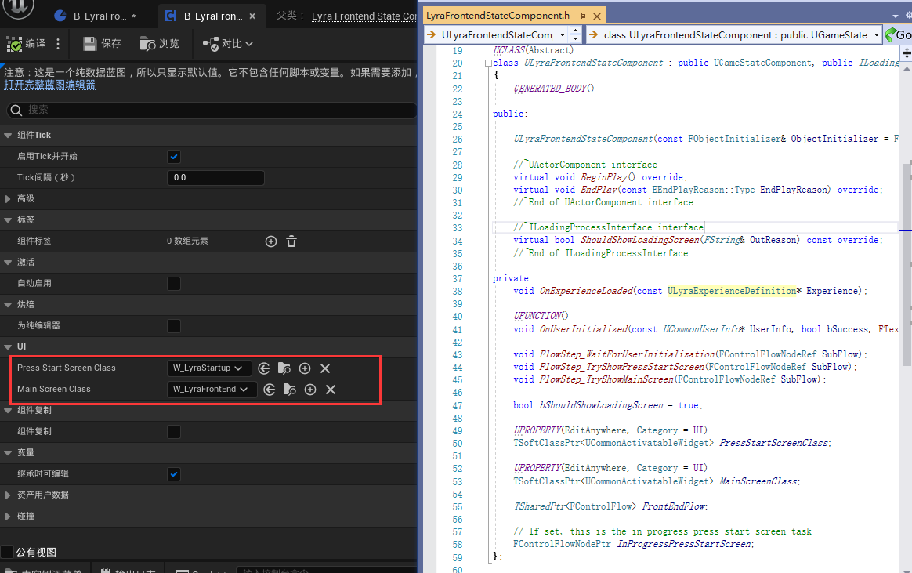
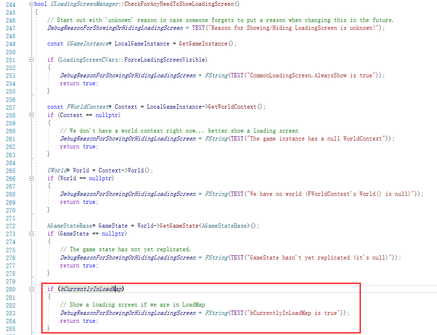

[TOC]

# Lyra

> 请结合工程代码阅读

## 默认配置

在Editor中，可以在项目设置中看到如下默认选项：

上述配置将影响`Lyra/Config/DefaultEngine.ini`的如下条目：

UE程序执行时将根据配置文件创建对应的蓝图实例，**LyraGameMode**的构造函数中绑定了各个状态对应的元类型（StaticClass），之后将根据这些绑定的**StaticClass**使用函数`SpawnActor`创建相应的实例。

## 关卡解析

### L_LyraFrontEnd

> 路径为：`Lyra\Content\System\FrontEnd\Maps\L_LyraFrontEnd.umap`

#### Experience

- Lyra覆盖了引擎的**WorldSetting**，并新增了**ULyraExperienceDefinition**属性，用于管理**GameFeature**，在当前关卡，它的值为**B_LyraFrontEnd_Experience**

  > 其路径为`Game/System/FrontEnd/B_LyraFrontEnd_Experience`

  

- 其中**B_LyraFrontEnd_Experience**继承自C++类**ULyraExperienceDefinition**：

  

- **B_LyraFrontEnd_Experience**中具有以下的**Actions**，它们会在程序开始时执行对应操作（比如**Add Components**，**Add Widgets**...）

  

#### 初始菜单

- 界面中的背景由蓝图`Lyra/Content/Environments/B_LoadRandomLobbyBackground`提供：

  > 其本质是加载关卡作为背景，其中加载的关卡为：`Lyra/Plugins/GameFeatures/ShooterMaps/Content/Maps/L_ShooterFrontendBackground.umap`

  

- 初始界面的前置菜单由蓝图类`/Game/UI/B_LyraFrontendStateComponent`提供，它继承自`Lyra/Source/LyraGame/UI/Frontend/LyraFrontendStateComponent`

  

- UI文件位于：

- 源码中会依次加载UI

  

- 菜单中的按钮对应如下事件

  

- 单击按钮**StartGame** 将跳转到界面`Lyra/Content/UI/Menu/Experiences/W_ExperienceSelectionScreen`

- 点击事件如下：

  

- 其中加载游戏的主要操作在节点**Quick Play Session**中完成，主要运行步骤如下：

  > 该节点由`Lyra\Plugins\CommonUser\Source\CommonUser\UCommonSessionSubsystem`提供

  - 执行`UCommonSessionSubsystem::QuickPlaySession()`，查找Session。

    

  - 查找结束将调用`UCommonSessionSubsystem::HandleQuickPlaySearchFinished()`，如果找到Session则加入，否则创建Session：

    

  - 对于`UCommonSessionSubsystem::HostSession()`，将执行以下逻辑，默认情况下会走**CreateOnlineSessionInternal(LocalPlayer, Request)**的分支

    

  - 其中`CreateOnlineSessionInternal()`会对PendingTravelURL赋值，并创建Session

    > 当前PendingTravelURL的值是：L"/ShooterMaps/Maps/L_Expanse?listen?Experience=B_ShooterGame_Elimination"

  - Session创建完毕将调用以下函数，通过**GetWorld()->ServerTravel(PendingTravelURL);**切换场景。

    

#### 加载页面

切换场景时，**ULoadingScreenManager**（public UGameInstanceSubsystem）的Tick函数会验证是否要显示LoadingScreen，上述的逻辑将导致以下分支：

- 其中bCurrentlyInLoadMap状态设置主要通过以下函数委托：

  

- 显示加载场景的逻辑如下：

  

- 最终，切换场景时将显示以下界面：

  

> 对于Subsystem，UE会根据反射信息，寻找Subsystem的派生类，并对其初始化：
>
> 

###  L_Convolution_Blockout

> 关卡蓝图中，仅有一个附加粒子的逻辑，且并未生效

#### Experience

该关卡的Experience为**B_LyraShooterGame_ControlPoints**

> 其路径为`Lyra/Plugins/GameFeatures/ShooterCore/Content/Experiences/B_LyraShooterGame_ControlPoints`

> 可以从上面的Actions看出场景运行时将加载：
>
> - UI
> - ControlPointScoring：控制点计分机制
> - PickRandomCharacter：随机角色（男性模型或女性模型）
> - TeamSetup_TwoTeams：队伍**生成**机制（该组件的作用是分为红蓝两队）
> - TeamSpawningRules：队伍**出生**机制
> - MusicManagerComponent：音频管理组件
> - ShooterBotSpawner：控制机器人的生成

#### 控制点计分(ControlPointScoring)

> 该关卡的游戏方式是：占领控制点，控制点多的队伍会持续加分，当分数累加到一定程度时，该队伍获胜。

蓝图**B_ControlPointScoring**的逻辑如下

> 位于`Lyra/Plugins/GameFeatures/ShooterCore/Content/ControlPoint/B_ControlPointScoring`

- 事件说明：
  - **事件开始运行**：开启一个名为Scroing的定时器。
  - **GameStart** （游戏开始后执行）：根据游戏人数来确定获胜所需的分数。
  - **CapturePoint**（占领控制点后执行）：根据控制点及当前控制点中的角色(0)获取到对应的**TeamId**，修改**ControlPointOwnerTeams**的值为对应的**ID**，并更新响应的Tag。
  - **RegisterControlPoint**（注册（创建）控制点时执行）：将控制点添加到数组**Control Points**中，并将**ControlPointOwnerTeams**对应**index**的元素置为**-1**表示中立。
  - **Scroing**（由上方的定时器触发）：用于定时去更新当前的比分，并判断游戏的胜利条件，结束时进行结算。

##### UI 

##### 控制点体积（ControlPointVolume）

> 此Actor蓝图位于`Lyra/Plugins/GameFeatures/ShooterCore/Content/Blueprint/B_ControlPointVolume`，

- 事件说明：
  - **事件开始运行**：触发事件**RegisterControlPoint**
  - **组件开始重叠时（Cube）**：触发事件**RecomputeContest**及**EnterAudio**
  - **组件结束重叠时（Cube）**：触发事件**RecomputeContest**及**ExitAudio**
  - **RecomputeContest**：将当前覆盖控制点体积的所有Actor的TeamID加入（**AddUnique**）到**OverlappingTeams**，如果只有一个Team，则开始占领控制点，此时会开启一个时间轴，并设置材质及Niagara粒子的颜色。

#### 随机角色（PickRandomCharacter）

该模块的作用是：随机生成男性(Manny)或女性(Quinn)角色。

> 该蓝图位于：Lyra/Content/Characters/Cosmetics/B_PickRandomCharacter

其中C++类主要在BeginPlay时做如下操作：

> 上述代码的作用是在**BeginPlay**时，将当前的Pawn，或者之后生成的Pawn，应用该蓝图的设置

#### 团队生成（TeamSetup_TwoTeams）

Lyra中默认使用**B_TeamSetup_TwoTeams**来定义队伍规模，其蓝图参数为：

> 位于`Lyra/Plugins/GameFeatures/ShooterCore/Content/Game/B_TeamSetup_TwoTeams`

**B_TeamSetup_TwoTeams**继承自C++类**ULyraTeamCreationComponent**，其主要逻辑如下：

> 位于`Lyra\Source\LyraGame\Teams\ULyraTeamCreationComponent.h`

> 可以看出该代码的作用是：当创建Experience或BeginPlay时，在服务器上根据参数**TeamsToCreate**去生成队伍。

#### 出生机制（TeamSpawningRules）

> 该组件用于控制如何在出生点  生成 团队角色

蓝图**B_TeamSpawningRules**的继承关系是

**B_TeamSpawningRules**->

**UTDM_PlayerSpawningManagmentComponent(C++)**->

**ULyraPlayerSpawningManagerComponent(C++)**

其中主要的操作是：

> 上述代码的逻辑是：
>
> - 加载关卡时，把Level中的所有**ALyraPlayerStart**存起来
> - 在World中生成Actor时，如果是**ALyraPlayerStart**，就存起来
> - 把当前World中的所有**ALyraPlayerStart**存起来

该组件提供了接口**ChoosePlayerStart**，该接口将根据所有的**ALyraPlayerStart**挑选Player的出生点

其中挑选逻辑的位于函数**OnChoosePlayerStart()**中，该函数为虚函数，其中子类**UTDM_PlayerSpawningManagmentComponent**的实现为：

需要注意的是接口**ChoosePlayerStart**，将由**ALyraGameMode::ChoosePlayerStart_Implementation()**调用，它又是由**GameModeBase**提供的接口：

在Lyra中，它的触发时机主要是C++内部调用**AGameModeBase::RestartPlayer(AController* NewPlayer)**，部分用例如下：

> 
>
> 
>
> 

#### AI生成（ShooterBotSpawner）

蓝图**B_ShooterBotSpawner**有以下参数：

> 可以看出上面的参数指定了：
>
> - 机器人生成的数量
> - 机器人类
> - 机器人随机名称池

其C++类中的挂载操作为：

> 可以看出，代码的逻辑是：加载Experience后在服务器上创建对应数量的机器人

### 尝试自定义射击关卡

#### 新增关卡

- 在如下目录新建Level——**L_MyLevel**

  

- 搭建基础场景

  

- 用网格简单搭建关卡地形，这里简单加了个地板，中间加了个立方体

  

- 在地图的四个角落放置**LyraPlayerStart**

  > 注意不是普通的**PlayerStart**，否则Lyra覆盖的WorldSetting将报错：
  >
  > 

  

#### 测试Experience

- 打开世界场景设置，做如下設置

  

  > 如果下拉选项没有，可在如下位置找到：
  >
  > 

- 启动游戏，能看到如下画面：

  

#### 自定义Experience

- 在文件夹**Plugins\ShooterCore\Experiences**下新建**蓝图类**，继承自C++类**LyraExperienceDefinition**，命名为**B_MyExperience**

  

  

- 构建**MyExperience**

  - 添加GameFeature—ShooterCore

    

  - 设置Pawn Data

    

  - 设置Action Set

    

  - 设置Experience的加载操作

    - 添加计分板UI

      > 绑定到HUD中

      

    - 添加技能

      > 包括角色的血量，伤害，复活机制

      

    - 添加组件

      - 加入音频管理组件

        

      - 加入控制点计分组件

        

      - 加入出生点控制组件

        

      - 加入团队分组组件

        - 新建蓝图类（派生于C++类**LyraTeamCreationComponent**），命名为**B_TeamCreationComponent**

          

        - 打开蓝图进行编辑，添加两个队伍（Lyra的游戏机制只允许有两个队伍），且注意标签为1,2

          

        - 在MyExperience中添加该组件

          

      - 自定义角色模型生成组件

        - 新建蓝图类**B_MyCharactorParts**，派生于C++类

          

        - 添加Part

          

        - 将该组件加入到Experience中

          

      - 加入AI生成器

        

      - 配置完毕

        

#### 游戏性道具

- 在场景中加入三个控制点

  

- 加入补血包

  

- 加入武器

  

- 加入跳跃点并设置其高度

  

- 加入多个传送门，并指定其传送目标

  

#### AI寻路

加入导航体积，并包裹住场景

### 大功告成

## 游戏机制

> Waiting

## 美术效果

> Waiting

## 架构简析

把Lyra的大致流程简单过了一遍，架构中比较深刻的是：

- Lrya通过覆盖UE默认的**引擎类**，为射击游戏提供了专门的事件及属性插槽，GameFeature中实现射击游戏的核心逻辑，并以插件的形式制作游戏的扩展，最终挂载到游戏主逻辑上。

### SubSystem

简单点说，SubSystem就是官方推荐的单例方案，相比传统的C++单例，它主要有以下好处：

- 依附在引擎中的已有的单例上（比如GameInstance，Engine，Editor等），SubSystem的生命周期由其同步和维护。

- 无需修改引擎代码，引擎执行时，会根据反射信息得到上述单例的派生类（**DerivedClass**）的元对象（**StaticClass**），创建所有的SubSystem，而SubSystem通过引擎提供的**事件插槽**进行构造并提供接口。

  > UE中很多结构都体现了这种插件式的架构思路

### **GameFeature**

将游戏机制封装为单独的模块，以插件的形式挂载到游戏主逻辑上，详见：

- https://www.zhihu.com/column/insideue4
- https://www.bilibili.com/video/BV1dL4y1h7YW?spm_id_from=333.337.search-card.all.click

> Waiting

### **GameplayAbilitySystem**

- https://docs.unrealengine.com/5.0/en-US/gameplay-ability-system-for-unreal-engine/

> Waiting

